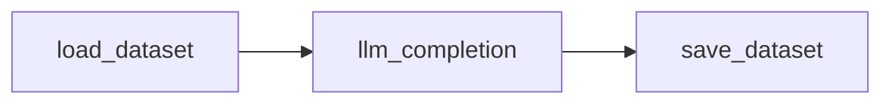
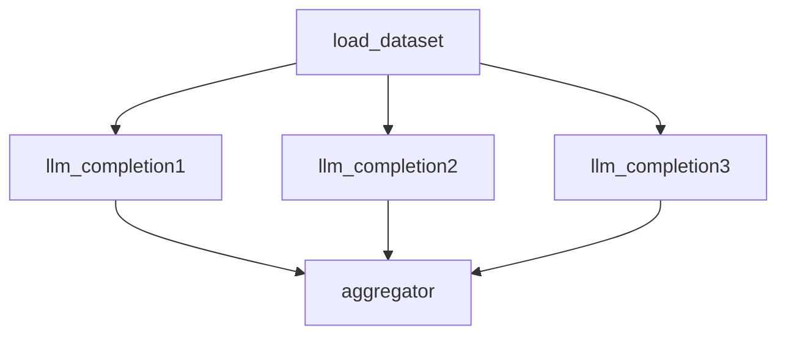
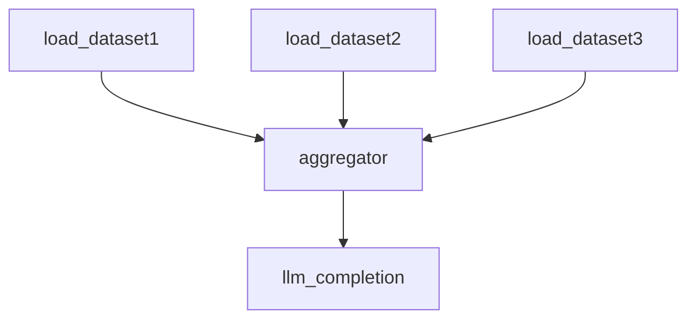
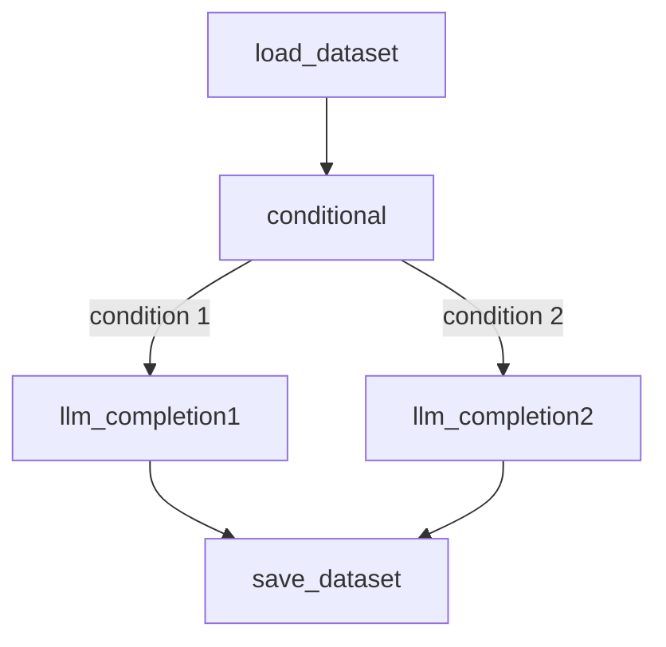
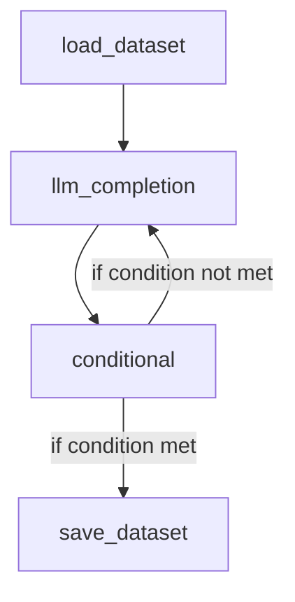
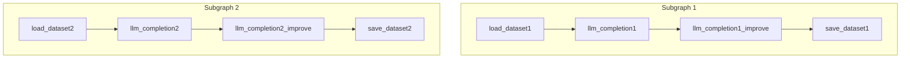

# SDG Hub v2 Architecture Design

## Table of Contents
1. [Motivation](#motivation)
2. [Architecture Overview](#architecture-overview)
3. [Features](#features)
4. [Examples](#examples)
5. [API Documentation](#api-documentation)
6. [Future Enhancements](#future-enhancements)

## Motivation

The SDG Hub is a framework for synthetic data generation that helps create high-quality datasets for training and evaluating AI systems. While the current implementation has been effective for many use cases, several limitations and pain points have emerged as the complexity and scale of data generation tasks have increased.

1. **Limited Composability**: The current pipeline-based approach enforces a linear execution flow through chained blocks. This makes it difficult to create more complex data generation workflows with parallel processing, conditional branches, or feedback loops. Each pipeline must process the entire dataset sequentially, even when parts of the workflow could be parallelized.

2. **Tight Coupling**: Blocks in the current design are tightly coupled with their execution context. Executing a couple of blocks require them to be wrapped in a pipeline - which needs a flow yaml for definition - which needs registration of llm prompts. This arised due to the previous (now stale) requirement of yaml driven definition.

3. **Redundant Configuration Logic**: There's significant redundancy in how configurations are loaded and processed across different blocks. Each flow file requires repetitive boilerplate configuration, increasing the likelihood of errors and making it harder to standardize best practices.

4. **Scalability Challenges**: While the current implementation includes basic parallelization through worker threads, this approach doesn't scale well for complex workflows or large datasets. The threading model becomes inefficient when dealing with I/O-bound operations typical in LLM-based generation. We need async/await to scale.

5. **Limited Customizability**: Even though the construct of block enables customization, there are a lot of boilerplate setup and configuration that is required. You can not simply wrap any python function as a block and expect it to work.


## Architecture Overview

To address these limitations, we are introducing a new graph-based architecture for SDG Hub v2. This redesign is centered around two core primitives - Nodes and Graph.

### Core Components/Primitives
#### Node
A Node is a self-contained, reusable unit of computation with well-defined inputs and outputs. Nodes encapsulate specific functionality (e.g., LLM completion, filtering, transformation) and can be composed together to form more complex workflows. Each Node implements a consistent interface that allows it to be connected to other Nodes in a Graph.

  - Well-defined input and output schemas
  - Isolated execution context
  - Easy to configure
  - Testable in isolation

There are three fundamental types of nodes in the SDG Hub v2 architecture:

- **Source Nodes**: These are entry points to the graph that generate or load initial data. They have no input dependencies and produce data that flows into the graph. Examples include:
   - Loading datasets from Hugging Face
   - Reading from local files

- **Process Nodes**: These nodes transform or process data as it flows through the graph. They take input data, perform operations, and produce output data. Examples include:
   - LLM completion nodes for text generation
   - Filtering nodes for data selection
   - Transformation nodes for data manipulation
   - Aggregation nodes for combining multiple data streams
   - Conditional nodes for branching logic

- **Sink Nodes**: These are exit points of the graph that consume data and typically perform final operations like saving or exporting. They take input data but don't produce output that flows to other nodes. Examples include:
   - Saving datasets to disk
   - Exporting to specific file formats

### Defining Nodes

Nodes can be defined in two ways:

1. **Class-based Definition**:
```python
from sdg_hub.v2.node.base import Node, NodeType
from datasets import Dataset

class MySourceNode(Node):
    def __init__(self, name: str = None):
        super().__init__(name=name, node_type=NodeType.SOURCE)
    
    def run(self, *inputs: Dataset) -> Iterator[Any]:
        # Source nodes typically don't take inputs
        for i in range(10):
            yield {"id": i, "text": f"Generated text {i}"}

class MyProcessNode(Node):
    def __init__(self, name: str = None):
        super().__init__(name=name, node_type=NodeType.TRANSFORM)
    
    def run(self, *inputs: Dataset) -> Iterator[Any]:
        for input_data in inputs:
            for row in input_data:
                # Process each row
                yield {"processed": row["text"].upper()}

class MySinkNode(Node):
    def __init__(self, name: str = None):
        super().__init__(name=name, node_type=NodeType.SINK)
    
    def run(self, *inputs: Dataset) -> Iterator[Any]:
        for input_data in inputs:
            for row in input_data:
                # Process and save data
                print(f"Saving: {row}")
                yield row
```

2. **Decorator-based Definition**:
```python
from sdg_hub.v2.node.decorator import Node
from datasets import Dataset

@Node(name="source_node", description="A source node that generates data")
def source_node():
    for i in range(10):
        yield {"id": i, "text": f"Generated text {i}"}

@Node(name="process_node", description="A node that processes data")
def process_node(inputs: Dataset):
    for row in inputs:
        yield {"processed": row["text"].upper()}

@Node(name="sink_node", description="A node that saves data")
def sink_node(inputs: Dataset):
    for row in inputs:
        print(f"Saving: {row}")
        yield row

# Async nodes are also supported
@Node(name="async_node", description="An async node")
async def async_node(inputs: Dataset):
    for row in inputs:
        # Do some async processing
        processed = await process_async(row)
        yield processed
```

The decorator approach is more concise and automatically handles:
- Node type detection based on input/output patterns
- Async/sync execution support
- Input/output validation
- Error handling and logging
- Node registration with the graph

#### Graph
A Graph represents the structure and flow of a data generation pipeline. It defines the relationships between Nodes, the paths data can take through the workflow, and the execution strategy. Graphs can range from simple linear sequences to complex directed acyclic graphs (DAGs) with branching, merging, and conditional paths.

  - Supports both sequential and parallel execution paths
  - Enables conditional branching based on data content or execution state
  - Allows cyclic execution to enable feedback loops
  - Allows for subgraphs as reusable components
  - Provides clear visualization of data flow and dependencies


- **Data**: Dataflow between blocks and pipelines is handled using Hugging Face Datasets, which are based on Arrow tables. This provides:

  - Native parallelization capabilities (e.g., maps, filters).
  - Support for efficient data transformations.
 

### Design Principles
1. **Composability**: Nodes should be designed to be combined in various ways without modification. New graphs can be created by connecting existing nodes, enabling rapid prototyping and experimentation.

2. **Extensibility**: The architecture should allow for easy addition of new node types, execution strategies, and data formats without changing core components. Users should be able to extend the system with custom functionality specific to their needs.

3. **Maintainability**: The system should have a clear separation of concerns, well-defined interfaces, and comprehensive documentation. This makes it easier to understand, debug, and modify components without unintended consequences.

4. **Observability**: Every step in the data generation process should be traceable and debuggable. The system should provide detailed logging, metrics, and visualization capabilities to help users understand what is happening at each stage.

5. **Scalability**: The architecture should support both vertical scaling (more efficient use of resources on a single machine) and horizontal scaling (distribution across multiple machines) for handling large-scale data generation tasks.

6. **User Experience**: Despite its power and flexibility, the system should remain accessible to users with varying levels of technical expertise. This includes providing intuitive APIs, clear documentation, and tools for common tasks.


## Features

1. **Flexible Graph Construction**
   - Support for complex topologies including branching, merging, and cycles
   - Ability to import/export serialized graph definitions for sharing and versioning

2. **Rich Node Ecosystem**
   - Standard library of nodes for common operations (LLM completion, transformation, filtering, etc.)
   - Support for custom node development with a simple, consistent API

3. **Native support for async/await**
   - Nodes can be async functions and will be executed asynchronously.
   - The graph will wait for all nodes to complete before completing the execution.

4. **Advanced Execution Strategies**
   - Parallel execution of independent nodes
   - Conditional execution based on data properties or runtime conditions
   - Feedback loops and recursive execution

4. **Robust Validation**
   - Since nodes and graphs are based on pydantic models, they are validated against the pydantic model before execution.
   - Dry run mode to validate the graph before execution.

5. **Visualization**
   - Export the graph to a DOT file or mermaid diagram


## Examples and Common Patterns

### Graph Patterns 
#### 1: Basic Linear Flow 
```python
with Graph(name="basic-linear-flow", description="A basic linear flow for generating question-answer pairs using an LLM") as graph:
   source_node = source(name="load_dataset", inputs=["HuggingFaceH4/mt_bench_prompts"])
   processor_node = llm(name="llm_completion", inputs=["prompt"], outputs=["output"])
   sink_node = sink(name="save_dataset", inputs=["output"])

   source_node >> processor_node >> sink_node

graph.run(
   parameters={
      "llm_completion": {
         "model": "mistral-7b",
         "temperature": 0.5,
         "max_tokens": 100,
      }
   }
)
```



#### 2: Fan-out
```python
with Graph(name="fan-out-graph", description="A graph with a source node, two processor nodes, and an aggregator node") as graph:
   source_node = source(name="load_dataset", inputs=["HuggingFaceH4/mt_bench_prompts"])
   processor1_node = llm(name="llm_completion1", inputs=["prompt"], outputs=["output1"])
   processor2_node = llm(name="llm_completion2", inputs=["prompt"], outputs=["output2"])
   processor3_node = llm(name="llm_completion3", inputs=["prompt"], outputs=["output3"])
   aggregator_node = aggregator(name="aggregator", inputs=["output1", "output2", "output3"], outputs=["aggregated"])
   
   source_node >> [processor1_node, processor2_node, processor3_node] >> aggregator_node

graph.run(
   parameters={
      "llm_completion1": {
         "model": "mistral-7b",
         "temperature": 0.5,
         "max_tokens": 100,
      },
      "llm_completion2": {
         "model": "llama3-8b",
         "temperature": 0.5,
         "max_tokens": 100,
      },
      "aggregator": {
         "strategy": "concatenate",
      }
   }
)
```



#### 3: Fan-in
```python 
with Graph(name="fan-in-graph", description="A graph with multiple sources, an aggregator node and a processor node") as graph:
   source1_node = source(name="load_dataset1", inputs=["HuggingFaceH4/mt_bench_prompts"])
   source2_node = source(name="load_dataset2", inputs=["anthropic/hh-rlhf"])
   source3_node = source(name="load_dataset3", inputs=["lymsys/chatbot-arena-train"])

   aggregator_node = aggregator(name="aggregator", inputs=["prompt1", "prompt2", "prompt3"], outputs=["aggregated"])
   processor_node = llm(name="llm_completion", inputs=["aggregated"], outputs=["output"])
   
   source1_node >> aggregator_node
   source2_node >> aggregator_node
   source3_node >> aggregator_node
   aggregator_node >> processor_node

graph.run(
   parameters={
      "llm_completion": {
         "model": "mistral-7b",
         "temperature": 0.5,
         "max_tokens": 100,
      }
   }
)
```



#### 4: Conditional Execution
```python
with Graph(name="conditional-execution-graph", description="A graph with a source node, a conditional node, and two processor nodes and final sink node") as graph:
   source_node = source(name="load_dataset", inputs=["HuggingFaceH4/mt_bench_prompts"])
   conditional_node = conditional(name="conditional", inputs=["prompt"], outputs=["categorized_prompt"])
   processor1_node = llm(name="llm_completion1", inputs=["categorized_prompt"], outputs=["output"])
   processor2_node = llm(name="llm_completion2", inputs=["categorized_prompt"], outputs=["output"])
   
   source_node >> conditional_node
   conditional_node >> processor1_node
   conditional_node >> processor2_node
   processor1_node >> sink_node
   processor2_node >> sink_node

graph.run()
```



#### 5: Cyclic Graphs 

```python 
with Graph(name="cyclic-graph", description="A graph with a source node, a processor node, a conditional node and a sink node") as graph:
   source_node = source(name="load_dataset", inputs=["HuggingFaceH4/mt_bench_prompts"])
   processor_node = llm(name="llm_completion", inputs=["prompt"], outputs=["output"])
   conditional_node = conditional(name="conditional", inputs=["output"], outputs=["categorized_output"])
   sink_node = sink(name="save_dataset", inputs=["categorized_output"])
   
   # keep the processor node running until the conditional node returns a specific value
   source_node >> processor_node
   processor_node >> conditional_node
   conditional_node >> processor_node
   conditional_node >> sink_node

graph.run()
```


#### 6: Parallel Processing Disconnected Graphs

```python
with Graph(name="parallel-processing-disconnected-graphs", description="Graph with two disconnected subgraphs") as graph:
   source_node1 = source(name="load_dataset1", inputs=["HuggingFaceH4/mt_bench_prompts"])
   source_node2 = source(name="load_dataset2", inputs=["HuggingFaceH4/mt_bench_prompts2"])
   processor1_node = llm(name="llm_completion1", inputs=["prompt"], outputs=["output"])
   processor2_node = llm(name="llm_completion2", inputs=["prompt"], outputs=["output"])
   processor1_improve_node = llm(name="llm_completion1_improve", inputs=["output"], outputs=["improved_output"])
   processor2_improve_node = llm(name="llm_completion2_improve", inputs=["output"], outputs=["improved_output"])

   sink1_node = sink(name="save_dataset1", inputs=["improved_output"])
   sink2_node = sink(name="save_dataset2", inputs=["improved_output"])

   source_node1 >> processor1_node >> processor1_improve_node >> sink1_node
   source_node2 >> processor2_node >> processor2_improve_node >> sink2_node

graph.run()
```



## API Documentation

TODO

## Future Enhancements

The SDG Hub v2 architecture provides a solid foundation that can be extended in various ways. Some potential future enhancements include:

- Caching
- Support Streaming Data
- Integration Ecosystem: Pre-built nodes for popular LLM Inference Endpoints, ML platforms, and storage systems.
- Monitoring and Alerts


By focusing on these areas of enhancement, SDG Hub v2 can continue to evolve to meet the needs of increasingly complex data generation workflows while maintaining its core principles of composability, extensibility, and maintainability.
