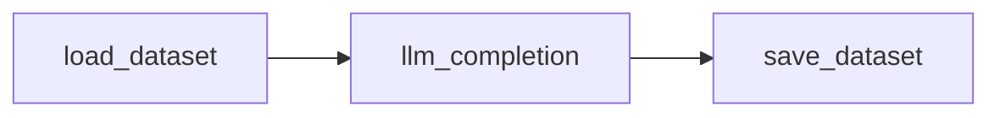
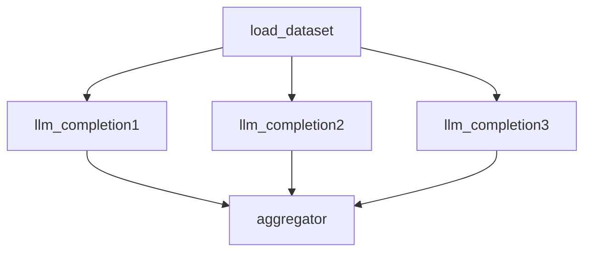
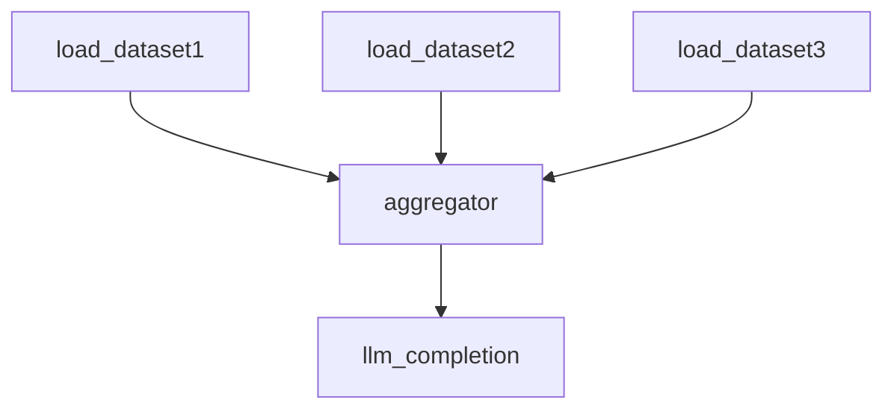
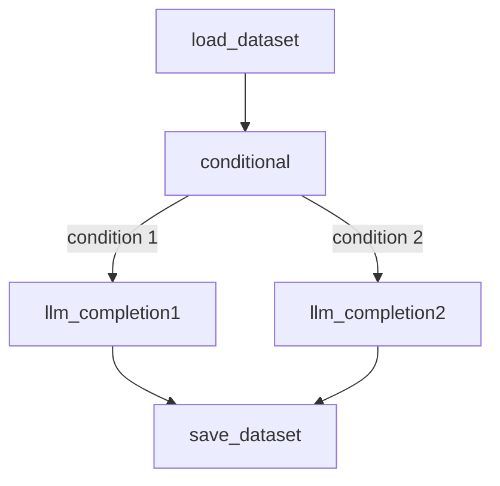
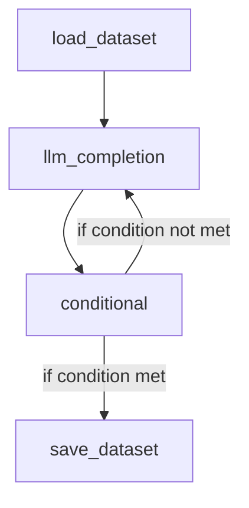

# SDG Hub v2 Architecture Design

## Table of Contents
1. [v1 Architecture Overview](#v1-architecture-overview)
2. [v2 Architecture Overview](#v2-architecture-overview)
3. [API Mockups](#api-mockups)
4. [Example Graph Patterns](#example-graph-patterns)
5. [Future Enhancements](#future-enhancements)


## v1 Architecture Overview

#### Block 
At the heart of the framework is the Block. Each block is a self-contained computational unit that performs specific tasks, such as:

- Making LLM calls
- Performing data transformations
- Applying filters

#### Pipeline
Blocks can be chained together to form a Pipeline. Pipelines enable:

- Linear or recursive chaining of blocks.
- Execution of complex workflows by chaining multiple pipelines together.

#### Flow 
The YAML configuration file, known as the Flow, is central to defining data generation workflows in the SDG Framework. A Flow describes how blocks and pipelines are orchestrated to process and generate data

```yaml
- block_type: LLMBlock
  block_config:
    block_name: gen_questions
    config_path: configs/skills/freeform_questions.yaml
    model_id: mistralai/Mixtral-8x7B-Instruct-v0.1
    output_cols:
      - question
    batch_kwargs:
      num_samples: 30
  drop_duplicates:
    - question
- block_type: FilterByValueBlock
  block_config:
    block_name: filter_questions
    filter_column: score
    filter_value: 1.0
    operation: operator.eq
    convert_dtype: float
    batch_kwargs:
      num_procs: 8
  drop_columns:
    - evaluation
    - score
    - num_samples
- block_type: LLMBlock
  block_config:
    block_name: gen_responses
    config_path: configs/skills/freeform_responses.yaml
    model_id: mistralai/Mixtral-8x7B-Instruct-v0.1
    output_cols:
      - response
```

#### SDG
The SDG class is the orchestrator that manages the execution of data generation workflows. It provides several key features:

- Pipeline Management: Takes a list of pipelines and executes them in sequence
- Hosts the Parallel Processing Logic: Splits the dataset into batches and processes them in parallel using multi-worker execution through ThreadPoolExecutor
- Checkpointing: Supports saving intermediate results to data checkpoints and resuming from them


## Pain Points with v1 Architecture

- **YAML Based Definition**: The current design is tightly coupled with the YAML based definition of flows. This makes it difficult to extend the framework to support pythonic definition. 
- **No explicit connections between blocks**: There's no explicit way to connect blocks together. The only way to achieve this is to wrap them in a pipeline
- **Sequential Execution**: The current pipeline object is basically a list of blocks, which triggers the sequential execution of blocks. This makes it difficult to create more complex workflows with parallel processing, conditional branches, or feedback loops
- **Tight Coupling**: Blocks in the current design are tightly coupled with their execution context. Executing a couple of blocks require them to be wrapped in a pipeline - which needs a flow yaml for definition - which needs registration of llm prompts. This arised due to the previous (now stale) requirement of yaml driven definition.


## v2 Architecture Overview

To address these limitations, we are introducing a new graph-based architecture for SDG Hub v2. This redesign is centered around two core primitives - Nodes and Graph.

### Core Components/Primitives
#### Node
A Node is a self-contained, reusable unit of computation with well-defined inputs and outputs. Nodes encapsulate specific functionality (e.g., LLM completion, filtering, transformation) and can be composed together to form more complex workflows. Each Node implements a consistent interface that allows it to be connected to other Nodes in a Graph.

  - Well-defined input and output schemas
  - Isolated execution context
  - Easy to configure
  - Testable in isolation

There are three fundamental types of nodes in the SDG Hub v2 architecture:

- **Source Nodes**: These are entry points to the graph that generate or load initial data. They have no input dependencies and produce data that flows into the graph. Examples include:
   - Loading datasets from Hugging Face
   - Reading from local files

- **Process Nodes**: These nodes transform or process data as it flows through the graph. They take input data, perform operations, and produce output data. Examples include:
   - LLM completion nodes for text generation
   - Filtering nodes for data selection
   - Transformation nodes for data manipulation
   - Aggregation nodes for combining multiple data streams
   - Conditional nodes for branching logic

- **Sink Nodes**: These are exit points of the graph that consume data and typically perform final operations like saving or exporting. They take input data but don't produce output that flows to other nodes. Examples include:
   - Saving datasets to disk
   - Exporting to specific file formats


#### Graph
A Graph represents the structure and flow of a data generation pipeline. It defines the relationships between Nodes, the paths data can take through the workflow, and the execution strategy. Graphs can range from simple linear sequences to complex directed acyclic graphs (DAGs) with branching, merging, and conditional paths.

  - Supports both sequential and parallel execution paths
  - Enables conditional branching based on data content or execution state
  - Allows cyclic execution to enable feedback loops
  - Allows for subgraphs as reusable components
  - Provides clear visualization of data flow and dependencies


- **Data**: Dataflow between blocks and pipelines is handled using Hugging Face Datasets, which are based on Arrow tables. This provides:

  - Native parallelization capabilities (e.g., maps, filters).
  - Support for efficient data transformations.
 

## API Mockups

### Explicit Definition:
```python
from sdg_hub.v2.node import Node, NodeType
from sdg_hub.v2.graph import Graph
from datasets import Dataset

class MySourceNode(Node):
    def __init__(self, name: str = None):
        super().__init__(name=name, node_type=NodeType.SOURCE)
    
    def run(self, *inputs: Dataset) -> Iterator[Any]:
        # Source nodes typically don't take inputs
        for i in range(10):
            yield {"id": i, "text": f"Generated text {i}"}

class MyProcessNode(Node):
    def __init__(self, name: str = None):
        super().__init__(name=name, node_type=NodeType.TRANSFORM)
    
    def run(self, *inputs: Dataset) -> Iterator[Any]:
        for input_data in inputs:
            for row in input_data:
                # Process each row
                yield {"processed": row["text"].upper()}

class MySinkNode(Node):
    def __init__(self, name: str = None):
        super().__init__(name=name, node_type=NodeType.SINK)
    
    def run(self, *inputs: Dataset) -> Iterator[Any]:
        for input_data in inputs:
            for row in input_data:
                # Process and save data
                print(f"Saving: {row}")
                yield row

graph = Graph(name="my_graph", description="A graph with a source node, a process node and a sink node")
graph.add_node(MySourceNode(name="source_node"))
graph.add_node(MyProcessNode(name="process_node"))
graph.add_node(MySinkNode(name="sink_node"))

graph.add_edge("source_node", "process_node")
graph.add_edge("process_node", "sink_node")

graph.run()
```

### Syntactic Sugar:
```python
from sdg_hub.v2.node import Node, NodeType 
from sdg_hub.v2.graph import Graph
from datasets import Dataset

@Node(name="source_node", node_type=NodeType.SOURCE, description="A source node that generates data")
def source_node():
    for i in range(10):
        yield {"id": i, "text": f"Generated text {i}"}

@Node(name="process_node", node_type=NodeType.TRANSFORM, description="A node that processes data")
def process_node(inputs: Dataset):
    for row in inputs:
        yield {"processed": row["text"].upper()}

@Node(name="sink_node", node_type=NodeType.SINK, description="A node that saves data")
def sink_node(inputs: Dataset):
    for row in inputs:
        print(f"Saving: {row}")
        yield row

with Graph(name="my_graph", description="A graph with a source node, a process node and a sink node") as graph:
   source_node = source_node()
   process_node = process_node()
   sink_node = sink_node()

   source_node >> process_node >> sink_node

graph.run()
```


## Example Graph Patterns

### 1: Basic Linear Flow 
```python
with Graph(name="basic-linear-flow", description="A basic linear flow for generating question-answer pairs using an LLM") as graph:
   source_node = source(name="load_dataset", inputs=["HuggingFaceH4/mt_bench_prompts"])
   processor_node = llm(name="llm_completion", inputs=["prompt"], outputs=["output"])
   sink_node = sink(name="save_dataset", inputs=["output"])

   source_node >> processor_node >> sink_node

graph.run(
   parameters={
      "llm_completion": {
         "model": "mistral-7b",
         "temperature": 0.5,
         "max_tokens": 100,
      }
   }
)
```



### 2: Fan-out
```python
with Graph(name="fan-out-graph", description="A graph with a source node, two processor nodes, and an aggregator node") as graph:
   source_node = source(name="load_dataset", inputs=["HuggingFaceH4/mt_bench_prompts"])
   processor1_node = llm(name="llm_completion1", inputs=["prompt"], outputs=["output1"])
   processor2_node = llm(name="llm_completion2", inputs=["prompt"], outputs=["output2"])
   processor3_node = llm(name="llm_completion3", inputs=["prompt"], outputs=["output3"])
   aggregator_node = aggregator(name="aggregator", inputs=["output1", "output2", "output3"], outputs=["aggregated"])
   
   source_node >> [processor1_node, processor2_node, processor3_node] >> aggregator_node

graph.run(
   parameters={
      "llm_completion1": {
         "model": "mistral-7b",
         "temperature": 0.5,
         "max_tokens": 100,
      },
      "llm_completion2": {
         "model": "llama3-8b",
         "temperature": 0.5,
         "max_tokens": 100,
      },
      "aggregator": {
         "strategy": "concatenate",
      }
   }
)
```



### 3: Fan-in
```python 
with Graph(name="fan-in-graph", description="A graph with multiple sources, an aggregator node and a processor node") as graph:
   source1_node = source(name="load_dataset1", inputs=["HuggingFaceH4/mt_bench_prompts"])
   source2_node = source(name="load_dataset2", inputs=["anthropic/hh-rlhf"])
   source3_node = source(name="load_dataset3", inputs=["lymsys/chatbot-arena-train"])

   aggregator_node = aggregator(name="aggregator", inputs=["prompt1", "prompt2", "prompt3"], outputs=["aggregated"])
   processor_node = llm(name="llm_completion", inputs=["aggregated"], outputs=["output"])
   
   source1_node >> aggregator_node
   source2_node >> aggregator_node
   source3_node >> aggregator_node
   aggregator_node >> processor_node

graph.run(
   parameters={
      "llm_completion": {
         "model": "mistral-7b",
         "temperature": 0.5,
         "max_tokens": 100,
      }
   }
)
```



### 4: Conditional Execution
```python
with Graph(name="conditional-execution-graph", description="A graph with a source node, a conditional node, and two processor nodes and final sink node") as graph:
   source_node = source(name="load_dataset", inputs=["HuggingFaceH4/mt_bench_prompts"])
   conditional_node = conditional(name="conditional", inputs=["prompt"], outputs=["categorized_prompt"])
   processor1_node = llm(name="llm_completion1", inputs=["categorized_prompt"], outputs=["output"])
   processor2_node = llm(name="llm_completion2", inputs=["categorized_prompt"], outputs=["output"])
   
   source_node >> conditional_node
   conditional_node >> processor1_node
   conditional_node >> processor2_node
   processor1_node >> sink_node
   processor2_node >> sink_node

graph.run()
```



### 5: Cyclic Graphs 

```python 
with Graph(name="cyclic-graph", description="A graph with a source node, a processor node, a conditional node and a sink node") as graph:
   source_node = source(name="load_dataset", inputs=["HuggingFaceH4/mt_bench_prompts"])
   processor_node = llm(name="llm_completion", inputs=["prompt"], outputs=["output"])
   conditional_node = conditional(name="conditional", inputs=["output"], outputs=["categorized_output"])
   sink_node = sink(name="save_dataset", inputs=["categorized_output"])
   
   # keep the processor node running until the conditional node returns a specific value
   source_node >> processor_node
   processor_node >> conditional_node
   conditional_node >> processor_node
   conditional_node >> sink_node

graph.run()
```



## Future Enhancements

The SDG Hub v2 architecture provides a solid foundation that can be extended in various ways. Some potential future enhancements include:

- Caching
- Parallel Processing of disconnected graphs
- Support Streaming Data
- Integration Ecosystem: Pre-built nodes for popular LLM Inference Endpoints, ML platforms, and storage systems.
- Monitoring and Alerts


By focusing on these areas of enhancement, SDG Hub v2 can continue to evolve to meet the needs of increasingly complex data generation workflows while maintaining its core principles of composability, extensibility, and maintainability.
