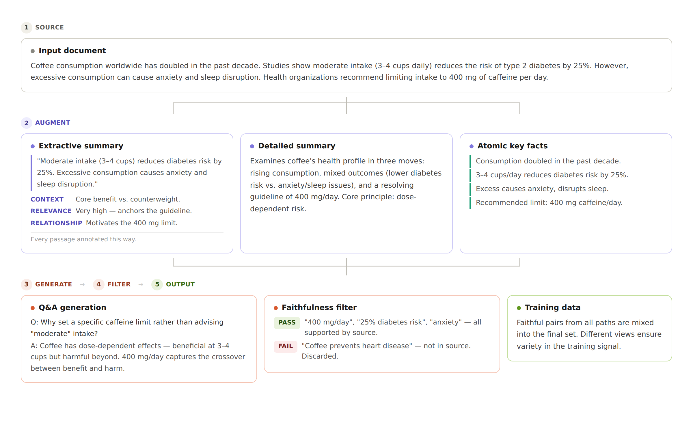
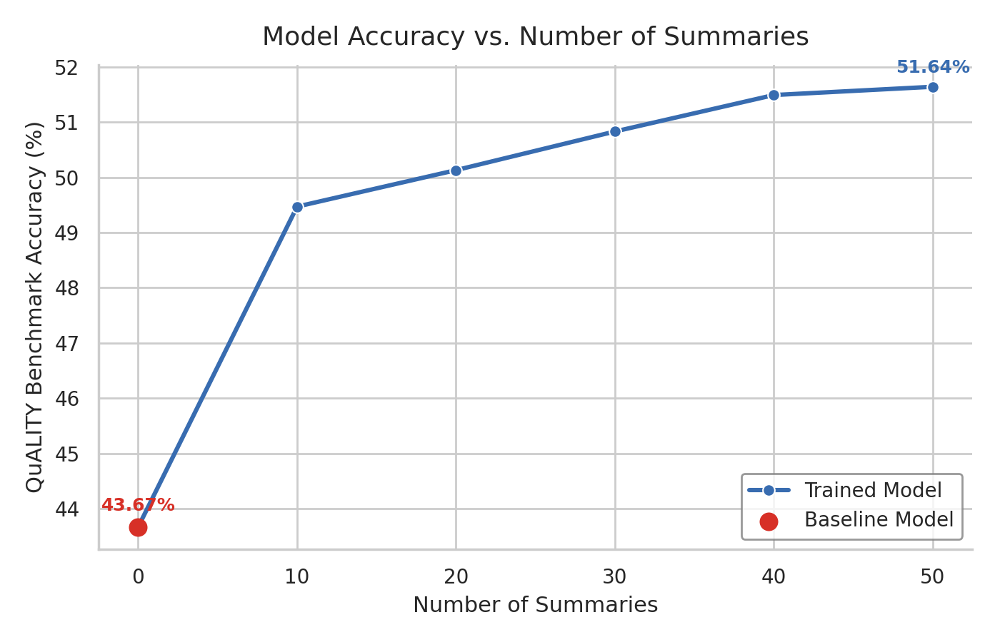

# Knowledge Tuning: Teaching LLMs New Facts with Synthetic Data

[Back to overview](../README.md)

Pre-trained language models encounter most facts in their training data only once or twice. Knowledge of specific details — especially from proprietary or domain-specific documents — is often incomplete or missing entirely. **Knowledge tuning** addresses this by generating synthetic training data that repeats and reinforces information from target documents, enabling a model to internalize facts it has never seen before.

This post walks through the full pipeline: how we generate training data from documents, what the resulting models look like after supervised fine-tuning (SFT), and how the approach generalizes to custom documents.

---

## Table of Contents

1. [The Data Generation Pipeline](#the-data-generation-pipeline)
2. [Four Complementary Augmentation Strategies](#four-complementary-augmentation-strategies)
3. [Quality Control: Faithfulness Filtering](#quality-control-faithfulness-filtering)
4. [Mixing and Training Data Preparation](#mixing-and-training-data-preparation)
5. [SFT Benchmark Results](#sft-benchmark-results)
6. [Applying to Custom Documents](#applying-to-custom-documents)

---

## The Data Generation Pipeline

The core idea is simple: take a document, create multiple augmented representations of it, and then generate question-answer pairs grounded in those representations. By varying the type of augmentation, we force the model to engage with the same content from different angles — extractive passages, high-level summaries, atomic facts, and direct Q&A.

<p align="center">
  
</p>

Each augmentation type produces a different "view" of the document. The Q&A pairs generated from these views are then filtered for faithfulness against the source material, ensuring the training data doesn't contain hallucinated facts.

The pipeline is implemented as composable YAML-defined flows using the SDG Hub framework. Each flow chains together blocks — prompt builders, LLM calls, parsers, and filters — into a reproducible data generation pipeline. The notebooks [`knowledge_generation.ipynb`](../knowledge_generation.ipynb) and [`knowledge_mixing.ipynb`](../knowledge_mixing.ipynb) drive the full process end to end.

---

## Four Complementary Augmentation Strategies

### 1. Extractive Summary

The extractive summary flow extracts key passages directly from the document and annotates each with contextual metadata:

- **Context Marker** — where the passage fits in the document's narrative
- **Relevance Rating** — importance level (Low to Very High) with justification
- **Relationship** — how the passage connects to other concepts in the document

This produces a structured representation that preserves the document's original language while adding analytical scaffolding. The LLM then generates questions that test understanding of both the content and its structural relationships.

**Why it works:** By extracting passages with annotations rather than paraphrasing, the model learns to ground answers in specific textual evidence. The annotations encourage reasoning about relationships between facts.

**Generation config:** 50 summaries per document at temperature 0.7, producing diverse extractions from the same source.

### 2. Detailed Summary

The detailed summary flow creates abstract conceptual representations — capturing overarching themes, main arguments, and core principles rather than specific passages.

The prompt asks the LLM to:
> *Summarize the given document in an Abstract Conceptual Layer representation such that it captures overarching themes, main arguments, and core principles. Make sure to include all the details from the document in the summary.*

**Why it works:** This complements the extractive approach. Where extractive summaries anchor to specific text, detailed summaries force the model to synthesize and connect ideas at a higher level of abstraction.

**Generation config:** 50 summaries per document at temperature 0.7.

### 3. Atomic Key Facts

The key facts flow breaks documents into standalone factual statements, each with contextual grounding. It then generates **5 Q&A pairs per fact** with variation in phrasing.

The process has two stages:

1. **Fact extraction** — Break the document into atomic facts following principles: identify key claims, decompose compound sentences, and provide context for each fact.
2. **Q&A generation** — For each atomic fact, generate 5 question-answer pairs that introduce variation while staying grounded in the fact.

**Why it works:** This is the densest coverage strategy. A single document might yield dozens of atomic facts, each producing 5 Q&A pairs. The variation in phrasing teaches the model to recognize the same fact from different angles.

### 4. Document Direct Q&A

The simplest approach: generate Q&A pairs directly from the raw document without any intermediate summary step. Questions are generated using in-context learning examples that demonstrate the desired style — self-contained, varied difficulty, and independently answerable without reference to tables or figures.

**Generation config:** Temperature 1.0 (higher than other flows) for maximum diversity in question types.

**Why it's included:** It serves as a complementary signal. The other flows transform the document before generating Q&A; this flow tests the model's ability to work with unprocessed information.

---

## Quality Control: Faithfulness Filtering

Every Q&A pair (except those from the key facts flow) goes through a **faithfulness evaluation** before entering the training set. This is a critical step — without it, the LLM's tendency to hallucinate would contaminate the training data.

The evaluation works as follows:

1. Present an LLM with the generated answer and the original document.
2. Ask it to determine whether the answer is **corroborated** by the document.
3. Require an explanation before the final YES/NO judgment.
4. **Filter out any pair where the judgment is NO.**

The evaluation prompt provides clear guidelines:
- Answer **YES** when the context provides direct or indirect evidence supporting the response.
- Answer **NO** if the context lacks support, contradicts the response, or is too vague to confirm it.
- Avoid "partially" — if any reasonable support exists, answer YES.

This binary filtering removes hallucinations while retaining answers that are reasonably grounded, even if they synthesize information from multiple parts of the document.

---

## Mixing and Training Data Preparation

After generation, the raw outputs from all four flows need to be combined and formatted for training. The [`knowledge_mixing.ipynb`](../knowledge_mixing.ipynb) notebook handles this using several strategies:

### Controlling Data Distribution

The "cut" parameter controls how many unique summaries per document are included in each training mix:

- **`n_docs_per_raw`** — Maximum unique summaries per original document (e.g., 10, 20, 50)
- **`qa_per_doc`** — Maximum Q&A pairs retained per summary (default: 3)

This allows scaling the training data volume. With 50 summaries and 3 Q&A pairs each, a single document can produce ~150 training examples across the extractive and detailed summary flows, plus additional examples from key facts and direct Q&A.

### Training Format

Each training example is formatted as a chat message pair:

```json
{
  "messages": [
    {"role": "user", "content": "<document_title>\n<document_or_summary>\n\n<question>"},
    {"role": "assistant", "content": "<answer>"}
  ]
}
```

The document context is included in the user message, teaching the model to ground its responses in provided text — a pattern that transfers well to RAG settings at inference time.

### Token Count Scaling

Increasing the number of summary cuts directly scales the training data:

| Cuts per Document | Total Token Count |
|---|---|
| Input Corpus | 1,517,465 |
| 10 | 87,248,889 |
| 20 | 158,615,276 |
| 30 | 230,306,195 |
| 40 | 301,805,906 |
| 50 | 373,183,414 |

---

## SFT Benchmark Results

We evaluated the pipeline using the [QuALITY benchmark](https://nyu-mll.github.io/quality/) — a reading comprehension dataset with multiple-choice questions about long documents.

**Setup:**
- **Teacher model (data generation):** `openai/gpt-oss-120b`
- **Student model:** `meta-llama/Llama-3.1-8B-Instruct`
- **Training method:** Supervised Fine-Tuning (SFT)
- **Evaluation metric:** Exact Match accuracy

<p align="center">
  
</p>

<p align="center">
  <em>Model accuracy on the QuALITY benchmark, comparing SFT on enhanced document summaries against the original model.</em>
</p>

SFT on the generated data consistently outperforms the base model across the benchmark. The multi-perspective augmentation strategy — combining extractive, detailed, key fact, and direct Q&A data — provides broader coverage than any single augmentation type alone.

---

## Applying to Custom Documents

The pipeline is designed to work with **any document collection**, not just public benchmarks. To demonstrate this, we applied it to BMO financial documents — a real-world corpus of proprietary content that the base model has limited knowledge of.

### Evaluation Setup

We evaluate in a **retrieval-augmented generation (RAG)** setting with two configurations:

- **RAG Score** — Vector store contains only the documents the model was trained on. Measures how well injected knowledge improves performance when relevant context is retrieved.
- **Large Scale RAG Score** — Vector store contains all BMO documents, including ones not used for training. Tests robustness when the retrieval pool is diluted with unseen content.

### Results

| Training Method | Teacher Model | Student Model | RAG Score | Large Scale RAG Score |
|---|---|---|---|---|
| Baseline (no training) | — | meta-llama/Llama-3.1-8B-Instruct | 205.5 | 201 |
| SFT | meta-llama/Llama-3.3-70B-Instruct | meta-llama/Llama-3.1-8B-Instruct | 215 | 213 |
| SFT | openai/gpt-oss-120b | meta-llama/Llama-3.1-8B-Instruct | **221.5** | 219 |

### What We Learn

**Teacher model quality matters.** Moving from Llama 3.3 70B to GPT-OSS-120B as the teacher for data generation improved the RAG score from 215 to 221.5 — a meaningful gain from better synthetic data alone, with no change to the training method or student model.

**The approach is robust to retrieval noise.** Large Scale RAG scores (which include unseen documents in the retrieval pool) remain within a few points of the focused RAG scores. The fine-tuned model doesn't degrade when the vector store is diluted — it still surfaces the right knowledge.

**SFT on synthetic data beats prompting.** The baseline model scores 205.5 with RAG — it can use retrieved context but lacks deep document knowledge. SFT pushes this to 221.5, a 7.7% improvement that comes purely from training on pipeline-generated data.

---

## Getting Started

To run the pipeline on your own documents:

1. **Prepare documents** — Run [`document_pre_processing.ipynb`](../document_pre_processing.ipynb) to create seed data.
2. **Generate synthetic data** — Run [`knowledge_generation.ipynb`](../knowledge_generation.ipynb) to produce all four augmentation types.
3. **Mix and format** — Run [`knowledge_mixing.ipynb`](../knowledge_mixing.ipynb) to combine outputs into a training dataset.
4. **Fine-tune** — Use the resulting JSONL for SFT with your preferred training framework.

See the [main README](../README.md) for configuration details and environment setup.
