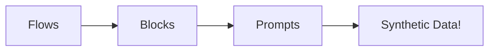
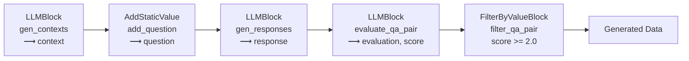

unstructured_to_structured.yaml:
```yaml
- block_type: LLMBlock
  block_config:
    block_name: gen_contexts
    config_path: configs/skills/contexts.yaml
    model_id: meta-llama/Llama-3.3-70B-Instruct
    output_cols:
      - context
  gen_kwargs:
    temperature: 0.7
    max_tokens: 4096
    n: 10
    seed: 42
  drop_duplicates:
    - context

- block_type: AddStaticValue
  block_config:
    block_name: add_question
    column_name: question
    static_value: Convert the above feedback into a markdown table with columns for Feature, Feedback, and Sentiment?

- block_type: LLMBlock
  block_config:
    block_name: gen_grounded_responses
    config_path: configs/skills/grounded_responses.yaml
    model_id: meta-llama/Llama-3.3-70B-Instruct
    output_cols:
      - response

- block_type: LLMBlock
  block_config:
    block_name: evaluate_grounded_qa_pair
    config_path: configs/skills/evaluate_grounded_pair.yaml
    model_id: meta-llama/Llama-3.3-70B-Instruct
    output_cols:
      - evaluation
      - score

- block_type: FilterByValueBlock
  block_config:
    block_name: filter_grounded_qa_pair
    filter_column: score
    filter_value: 2.0
    operation: operator.ge
    convert_dtype: float
    batch_kwargs:
      num_procs: 8
```

unstructured_to_structured_qna.yaml:
```yaml
created_by: Red Hat AI Innovation Team
domain: Information Extraction
task_description: Convert the following unstructured user feedback into a structured markdown table.
seed_examples:
  - context: "Been using the new dashboard for a few days. It's way faster than the previous one, really appreciate the snappy filters. But export to CSV seems broken — nothing happens when I click it. Also, dark mode resets every time I log in."
    question: Convert the above feedback into a markdown table with columns for Feature, Feedback, and Sentiment?
    answer: |
      | Feature        | Feedback                                                           | Sentiment |
      |----------------|--------------------------------------------------------------------|-----------|
      | Dashboard      | Much faster than previous version, filters are responsive.         | Positive  |
      | Export to CSV  | Clicking the export button doesn't trigger a download.             | Negative  |
      | Dark Mode      | Resets to light mode on login.                                     | Negative  |

  - context: "Really love the new calendar UI. The drag-and-drop is intuitive. One issue: reminders don't always sync between desktop and mobile. Also noticed tooltips sometimes cover buttons."
    question: Convert the above feedback into a markdown table with columns for Feature, Feedback, and Sentiment?
    answer: |
      | Feature         | Feedback                                                           | Sentiment |
      |-----------------|--------------------------------------------------------------------|-----------|
      | Calendar UI     | Drag-and-drop is intuitive and easy to use.                        | Positive  |
      | Reminders Sync  | Inconsistent between desktop and mobile devices.                   | Negative  |
      | Tooltips        | Occasionally block button access.                                  | Negative  |

  - context: "Love the app in general, especially how smooth the onboarding was. However, support chat is too hidden — took me forever to find. Also, app crashed once while editing a task."
    question: Convert the above feedback into a markdown table with columns for Feature, Feedback, and Sentiment?
    answer: |
      | Feature       | Feedback                                                 | Sentiment |
      |---------------|----------------------------------------------------------|-----------|
      | Onboarding    | Smooth experience, user was impressed.                   | Positive  |
      | Support Chat  | Difficult to locate, not visible enough.                 | Negative  |
      | Task Editor   | App crashed while editing a task.                        | Negative  |

  - context: "Notifications are timely and helpful. One small bug: sometimes the same notification pops up twice. Also, is there a way to snooze them? Didn't find the option."
    question: Convert the above feedback into a markdown table with columns for Feature, Feedback, and Sentiment?
    answer: |
      | Feature           | Feedback                                               | Sentiment |
      |-------------------|--------------------------------------------------------|-----------|
      | Notifications     | Arrive on time and are useful.                         | Positive  |
      | Notification Bug  | Duplicate notifications appear occasionally.           | Negative  |
      | Snooze Option     | Snooze feature not found or not available.             | Neutral   |

  - context: "The analytics view is very informative. Would love to see breakdown by team as well. Charts sometimes take a few seconds to load though. Mobile layout is clean."
    question: Convert the above feedback into a markdown table with columns for Feature, Feedback, and Sentiment?
    answer: |
      | Feature         | Feedback                                              | Sentiment |
      |-----------------|-------------------------------------------------------|-----------|
      | Analytics View  | Provides useful insights.                             | Positive  |
      | Team Breakdown  | Requested feature not currently available.            | Neutral   |
      | Charts          | Load slowly on occasion.                              | Negative  |
      | Mobile Layout   | Clean and well-designed.                              | Positive  |
```

```python
%load_ext autoreload
%autoreload 2
```
```python
# SPDX-License-Identifier: Apache-2.0

"""Module containing the AddStaticValue block for adding constant values to dataset columns."""

# Standard
from typing import Any, Dict

# Third Party
from datasets import Dataset

# First Party
from sdg_hub.blocks import Block, BlockRegistry


@BlockRegistry.register("AddStaticValue")
class AddStaticValue(Block):
    """A custom block that adds a static value to a specified column in a dataset.

    This block is designed to populate a new or existing column in a dataset with a constant
    value. It's useful for adding metadata, labels, or any other static information to
    your dataset entries.

    Examples
    --------
    >>> block = AddStaticValue("add_label", "label", "positive")
    >>> dataset = block.generate(input_dataset)
    """

    def __init__(self, block_name: str, column_name: str, static_value: str) -> None:
        """Initialize the AddStaticValue block.

        Parameters
        ----------
        block_name : str
            The name of this block instance
        column_name : str
            The name of the column to populate with the static value
        static_value : str
            The constant value to be added to the specified column
        """
        super().__init__(block_name)
        self.column_name = column_name
        self.static_value = static_value

    # Using a static method to avoid serializing self when using multiprocessing
    @staticmethod
    def _map_populate_column(
        samples: Dataset, column_name: str, static_value: str, num_proc: int = 1
    ) -> Dataset:
        """Map function to populate a column with a static value.

        Parameters
        ----------
        samples : Dataset
            The input dataset to modify
        column_name : str
            The name of the column to populate
        static_value : str
            The constant value to add to the column
        num_proc : int, optional
            Number of processes to use for parallel processing, by default 1

        Returns
        -------
        Dataset
            The modified dataset with the new column populated
        """

        def populate_column(sample: Dict[str, Any]) -> Dict[str, Any]:
            sample[column_name] = static_value
            return sample

        return samples.map(populate_column, num_proc=num_proc)

    def generate(self, samples: Dataset) -> Dataset:
        """Generate a new dataset with the static value added to the specified column.

        Parameters
        ----------
        samples : Dataset
            The input dataset to modify

        Returns
        -------
        Dataset
            The modified dataset with the new column populated with the static value
        """
        samples = self._map_populate_column(
            samples, self.column_name, self.static_value
        )
        return samples
```
```python
# Standard
import random

# Third Party
from datasets import Dataset
from openai import OpenAI
from rich import print
from rich.console import Console
from rich.panel import Panel
import yaml

# First Party
from sdg_hub.flow import Flow
from sdg_hub.pipeline import Pipeline
from sdg_hub.sdg import SDG
from blocks import *
```

    /home/lab/.conda/envs/sdg_pr/lib/python3.11/site-packages/tqdm/auto.py:21: TqdmWarning: IProgress not found. Please update jupyter and ipywidgets. See https://ipywidgets.readthedocs.io/en/stable/user_install.html
      from .autonotebook import tqdm as notebook_tqdm


## Teaching a Language Model the Skill: Unstructured Text → Markdown Table

Company X receives large volumes of user feedback through support emails, in-app surveys, and app store reviews. These messages often contain valuable product insights, but the content is unstructured and difficult to analyze at scale.

To streamline internal workflows, an AI team at Company X wants to teach a language model how to convert raw user feedback into structured markdown tables. These tables summarize key topics, user sentiment, and issues in a format that’s easy to scan, report, or push into dashboards and tracking systems.

We can do this using InstructLab!

#### 🧾 Example Input and Output

📥 Input (Unstructured Feedback)
```
Hey team — I’ve been using the new update for about a week now.

Couple of things:
- The dark mode is awesome, great job!
- But the loading time after login feels slower than before. Not a deal breaker but noticeable.
- I also noticed that the calendar widget doesn’t update properly if I change time zones.

Overall, I love where this is going. Just needs a few tweaks.
```
📤 Output (Markdown Table)

| Feature           | Feedback                                                               | Sentiment |
|------------------|------------------------------------------------------------------------|-----------|
| Dark Mode        | Works well, user is satisfied.                                          | Positive  |
| Login Performance| Loading time after login is slower than previous version.               | Negative  |
| Calendar Widget  | Doesn't update correctly when time zones change.                        | Negative  |
| Overall          | User is happy with the direction of the product, but suggests tweaks.   | Positive  |

## Recap: Setting up data generation pipeline



## 🧑‍🏫 Step 1: Serving Teacher Model

This demo expects an openai compatible endpoint. You can use your favorite inference server like vLLM, HFInferenceServer, LlamaStack, etc. For more details on how to setup an inference server using vLLM, please refer to the [README](README.md).

For this demo we will use meta-llama/Llama-3.3-70B-Instruct as our teacher model.

#### Let's test the connection


```python
openai_api_key = "EMPTY"
openai_api_base = "http://0.0.0.0:8000/v1"


client = OpenAI(
    api_key=openai_api_key,
    base_url=openai_api_base,
)

models = client.models.list()
teacher_model = models.data[0].id

# Test the connection with a simple completion
response = client.chat.completions.create(
    model=teacher_model,
    messages=[{"role": "user", "content": "Hello!"}],
    temperature=0.0,
    max_tokens=10
)
completion = response.choices[0].message.content

print(f"Connection successful! {teacher_model}: {completion}")
```


<pre style="white-space:pre;overflow-x:auto;line-height:normal;font-family:Menlo,'DejaVu Sans Mono',consolas,'Courier New',monospace"><span style="color: #7fbfbf; text-decoration-color: #7fbfbf">[17:37:56] </span><span style="color: #000080; text-decoration-color: #000080">INFO    </span> HTTP Request: <span style="color: #808000; text-decoration-color: #808000; font-weight: bold">GET</span> <span style="color: #0000ff; text-decoration-color: #0000ff; text-decoration: underline">http://0.0.0.0:8000/v1/models</span> <span style="color: #008000; text-decoration-color: #008000">"HTTP/1.1 200 OK"</span>               <a href="file:///home/lab/.conda/envs/sdg_pr/lib/python3.11/site-packages/httpx/_client.py" target="_blank"><span style="color: #7f7f7f; text-decoration-color: #7f7f7f">_client.py</span></a><span style="color: #7f7f7f; text-decoration-color: #7f7f7f">:</span><a href="file:///home/lab/.conda/envs/sdg_pr/lib/python3.11/site-packages/httpx/_client.py#1025" target="_blank"><span style="color: #7f7f7f; text-decoration-color: #7f7f7f">1025</span></a>
</pre>


<pre style="white-space:pre;overflow-x:auto;line-height:normal;font-family:Menlo,'DejaVu Sans Mono',consolas,'Courier New',monospace"><span style="color: #7fbfbf; text-decoration-color: #7fbfbf">           </span><span style="color: #000080; text-decoration-color: #000080">INFO    </span> HTTP Request: <span style="color: #808000; text-decoration-color: #808000; font-weight: bold">POST</span> <span style="color: #0000ff; text-decoration-color: #0000ff; text-decoration: underline">http://0.0.0.0:8000/v1/chat/completions</span> <span style="color: #008000; text-decoration-color: #008000">"HTTP/1.1 200 OK"</span>    <a href="file:///home/lab/.conda/envs/sdg_pr/lib/python3.11/site-packages/httpx/_client.py" target="_blank"><span style="color: #7f7f7f; text-decoration-color: #7f7f7f">_client.py</span></a><span style="color: #7f7f7f; text-decoration-color: #7f7f7f">:</span><a href="file:///home/lab/.conda/envs/sdg_pr/lib/python3.11/site-packages/httpx/_client.py#1025" target="_blank"><span style="color: #7f7f7f; text-decoration-color: #7f7f7f">1025</span></a>
</pre>


<pre style="white-space:pre;overflow-x:auto;line-height:normal;font-family:Menlo,'DejaVu Sans Mono',consolas,'Courier New',monospace">Connection successful! meta-llama/Llama-<span style="color: #008080; text-decoration-color: #008080; font-weight: bold">3.3</span>-70B-Instruct: Hello. How can I help you today?
</pre>


## ✍️ Step 2: Provide Custom Examples

As outlined in the LAB paper, the first step is to provide a small number of **seed examples** (typically 5) to bootstrap the skill. These examples are passed into the generation pipeline as input and are stored in a `qna.yaml` file.

For this demo, we’ll use the pre-populated seed file located at: [unstructured_to_structured_qna.yaml](seed_data/unstructured_to_structured_qna.yaml)

```yaml
created_by: Red Hat AI Innovation Team
domain: Information Extraction
task_description: Convert the following unstructured user feedback into a structured markdown table.
seed_examples:
  - context: "Been using the new dashboard for a few days. It's way faster than the previous one, really appreciate the snappy filters. But export to CSV seems broken — nothing happens when I click it. Also, dark mode resets every time I log in."
    question: Convert the above feedback into a markdown table with columns for Feature, Feedback, and Sentiment?
    answer: |
      | Feature        | Feedback                                                           | Sentiment |
      |----------------|--------------------------------------------------------------------|-----------|
      | Dashboard      | Much faster than previous version, filters are responsive.         | Positive  |
      | Export to CSV  | Clicking the export button doesn't trigger a download.             | Negative  |
      | Dark Mode      | Resets to light mode on login.                                     | Negative  |
```

Lets convert the yaml into a jsonl file which can be used to bootstrap the skill.


```python
def convert_yaml_to_jsonl(yaml_path):
    # Load YAML file
    with open(yaml_path, 'r') as f:
        yaml_data = yaml.safe_load(f)
    
    # Extract examples into list of dicts
    examples = []
    for example in yaml_data['seed_examples']:
        examples.append({
            'task_description': yaml_data['task_description'],
            'seed_context': example['context'],
            'seed_question': example['question'],
            'seed_response': example['answer']
        })
    
    # Convert to HF Dataset
    dataset = Dataset.from_list(examples)
    return dataset

# Load and convert the seed data
seed_data = convert_yaml_to_jsonl('seed_data/unstructured_to_structured_qna.yaml')


print(Panel(
    "\n\n".join(f"[bold]{k}:[/bold] \n\n{v}" for k,v in seed_data[0].items()),
    title="Seed Data Example"
))

```


<pre style="white-space:pre;overflow-x:auto;line-height:normal;font-family:Menlo,'DejaVu Sans Mono',consolas,'Courier New',monospace">╭─────────────────────────────────────────────── Seed Data Example ───────────────────────────────────────────────╮
│ <span style="font-weight: bold">task_description:</span>                                                                                               │
│                                                                                                                 │
│ Convert the following unstructured user feedback into a structured markdown table.                              │
│                                                                                                                 │
│ <span style="font-weight: bold">seed_context:</span>                                                                                                   │
│                                                                                                                 │
│ Been using the new dashboard for a few days. It's way faster than the previous one, really appreciate the       │
│ snappy filters. But export to CSV seems broken — nothing happens when I click it. Also, dark mode resets every  │
│ time I log in.                                                                                                  │
│                                                                                                                 │
│ <span style="font-weight: bold">seed_question:</span>                                                                                                  │
│                                                                                                                 │
│ Convert the above feedback into a markdown table with columns for Feature, Feedback, and Sentiment?             │
│                                                                                                                 │
│ <span style="font-weight: bold">seed_response:</span>                                                                                                  │
│                                                                                                                 │
│ | Feature        | Feedback                                                           | Sentiment |             │
│ |----------------|--------------------------------------------------------------------|-----------|             │
│ | Dashboard      | Much faster than previous version, filters are responsive.         | Positive  |             │
│ | Export to CSV  | Clicking the export button doesn't trigger a download.             | Negative  |             │
│ | Dark Mode      | Resets to light mode on login.                                     | Negative  |             │
│                                                                                                                 │
╰─────────────────────────────────────────────────────────────────────────────────────────────────────────────────╯
</pre>


## 🚀 Step 3: Generate Synthetic Data

Now that we have our seed data ready, we can use LAB’s Skill Data Generator to create **high-quality synthetic training examples** for our custom skill.

This step leverages a predefined **flow configuration** that encodes how seed examples are expanded — by generating new contexts, questions, and responses, and filtering them for quality.

In this demo, we'll use the `flows/unstructured_to_structured.yaml` pipeline to generate synthetic data.

### Flows



### Blocks: Adding Custom Blocks

One of the core design goals of SDG Hub is **modularity and extensibility**. Creating a new block is as simple as writing a Python class. Any Pythonic transformation or logic—no matter how simple or complex—can be encapsulated as a block and plugged into a pipeline.

Here’s an example of how to create a custom block that adds a static value to every row in the dataset: [add_question.py](blocks/add_question.py)

✨ Why This Matters
* Simplicity: You can wrap any custom Python function into a block—no special framework or boilerplate needed.
* Composable: Once registered, blocks can be easily used in your YAML workflows alongside LLM-based and filtering blocks.
* Parallel-ready: Custom blocks can leverage the existing multiprocessing implementation.


```python
# Load the flow
flow = Flow(client).get_flow_from_file("flows/unstructured_to_structured.yaml")

# Initialize the synthetic data generator
generator = SDG(
    [Pipeline(flow)],
)
```


```python
generated_data = generator.generate(seed_data)
```

## 🔍 Step 4: Explore and Validate the Synthetically Generated Data

Once the skill generation pipeline has been executed, the output is a set of **synthetically generated examples** — new context-question-response triples that follow the same structure as the seed data but are expanded and refined by the teacher model.

Below is an example of one generated entry:


```python
console = Console()
rand_idx = random.choice(range(len(generated_data)))

# Pretty print the generated examples using rich
example = generated_data[rand_idx]
console.print(Panel.fit(
    f"[bold orange1]Context:[/bold orange1]\n{example['context']}\n\n"
    f"[bold cyan]Question:[/bold cyan]\n{example['question']}\n\n" 
    f"[bold green]Response:[/bold green]\n{example['response']}"
))
console.rule(style="bright_white")
```


<pre style="white-space:pre;overflow-x:auto;line-height:normal;font-family:Menlo,'DejaVu Sans Mono',consolas,'Courier New',monospace">╭─────────────────────────────────────────────────────────────────────────────────────────────────────────────────╮
│ <span style="color: #ffaf00; text-decoration-color: #ffaf00; font-weight: bold">Context:</span>                                                                                                        │
│ The application's search function is generally responsive, but it does not always yield the most relevant       │
│ results. Another problem is that the night mode feature can be inconsistent across different devices.           │
│ Furthermore, user profiles lack detailed information, and the messaging system occasionally fails to deliver    │
│ notifications in real-time. These issues hinder the overall user experience and require attention for           │
│ improvement.                                                                                                    │
│                                                                                                                 │
│ <span style="color: #008080; text-decoration-color: #008080; font-weight: bold">Question:</span>                                                                                                       │
│ Convert the above feedback into a markdown table with columns for Feature, Feedback, and Sentiment?             │
│                                                                                                                 │
│ <span style="color: #008000; text-decoration-color: #008000; font-weight: bold">Response:</span>                                                                                                       │
│ | Feature         | Feedback                                                           | Sentiment |            │
│ |-----------------|--------------------------------------------------------------------|-----------|            │
│ | Search Function | Generally responsive but does not always yield the most relevant results. | Negative  |     │
│ | Night Mode      | Inconsistent across different devices.                               | Negative  |          │
│ | User Profiles   | Lack detailed information.                                           | Negative  |          │
│ | Messaging System| Fails to deliver notifications in real-time occasionally.            | Negative  |          │
╰─────────────────────────────────────────────────────────────────────────────────────────────────────────────────╯
</pre>


<pre style="white-space:pre;overflow-x:auto;line-height:normal;font-family:Menlo,'DejaVu Sans Mono',consolas,'Courier New',monospace"><span style="color: #ffffff; text-decoration-color: #ffffff">───────────────────────────────────────────────────────────────────────────────────────────────────────────────────</span>
</pre>


## 💾 Save the generated data

```python
generated_data.to_json("llama_generated_unstructured_to_structured.jsonl", orient="records", lines=True)
```

## 🏁 Conclusion

In this notebook, we demonstrated how to teach a custom skill to a language model using the InstructLab Skill Data Generator (SDG). Starting from a small set of seed examples, we walked through the full synthetic data generation pipeline — including context creation, question generation, response synthesis, evaluation, and filtering.

We explored a real-world use case: **transforming unstructured user feedback into structured markdown tables**, and showed how the LAB framework can automate the generation of high-quality, instructional training data at scale.

This approach is especially powerful for procedural or domain-specific tasks where labeled data is scarce but consistent task logic can be modeled. With just a few carefully curated seed examples, you can unlock scalable skill creation and push new capabilities into LLMs with minimal manual effort.

You’re now ready to use these synthetic examples for Fine-tuning small models! 

Next steps? 

* Try changing the parameters of the flow to see how the generated data changes (e.g. change the `num_samples` or try generating with different temperature)
* Try adapting this pipeline to your own task, domain, or format — whether it’s triaging support tickets, extracting structured data, or following domain-specific workflows. The skills are yours to create.
